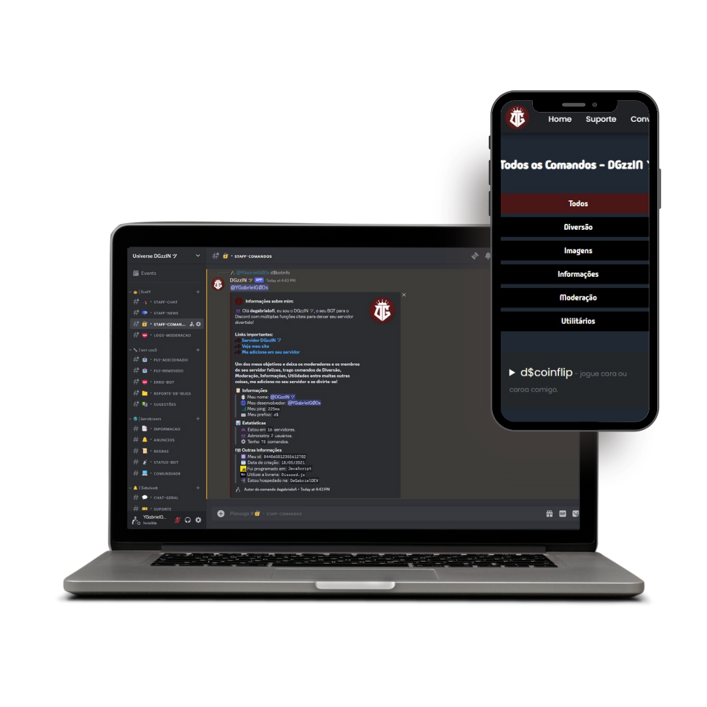

<h1 align="center">🤖 DGzzIN ツ</h1>

<p align="center">
   
  </p>

  <p align="center">
  
  
  
</p>

## 📌 System Requirements

- [git](https://git-scm.com/) v2.13 ou superior
- [NodeJS](https://nodejs.org/en) `14 || 16 || 18`
- [npm](https://www.npmjs.com/) v6 ou superior

Todos estes requerimentos devem estar disponíveis no seu `PATH`. Para verificar se tudo está configurado corretamente, você pode executar os comandos abaixo:

```shell
git --version
node --version
npm --version
```

Se você tiver problemas com qualquer um deles, saiba mais sobre o ambiente PATH e como corrigi-lo aqui para [Windows](https://www.howtogeek.com/118594/how-to-edit-your-system-path-for-easy-command-line-access/) ou
[Mac/Linux](https://stackoverflow.com/questions/24306398/how-to-add-mongo-commands-to-path-on-mac-osx/24322978#24322978).

# :clipboard: Sobre o projeto

O DGzzIN ツ é um bot desenvolvido para Discord, totalmente construído em JavaScript utilizando a biblioteca Discord.js. Ele foi criado a partir da minha paixão por trazer funcionalidade e diversão para comunidades online, mesmo sem experiência prévia em programação.

### Visão Geral:

O DGzzIN ツ foi projetado para oferecer uma variedade de comandos e funcionalidades para servidores do Discord, incluindo recursos de diversão, moderação, informações e utilidades. Com uma interface simples e amigável, o bot pode ser facilmente adicionado a qualquer servidor Discord para melhorar a experiência dos membros e moderadores.

### Funcionalidades Principais:

- **Diversão:** O DGzzIN ツ possui uma ampla gama de comandos divertidos para entreter os membros do servidor, incluindo jogos, piadas e interações engraçadas.

- **Moderação:** Para manter a ordem e o bom funcionamento do servidor, o DGzzIN ツ oferece ferramentas de moderação, como banimentos, mutações, limpeza de chat e muito mais.

- **Informações:** Os comandos de informação permitem aos usuários acessarem rapidamente dados úteis, como previsão do tempo, cotações de moeda, informações de usuários e muito mais.

- **Utilidades:** Além disso, o DGzzIN ツ oferece uma variedade de utilidades, como geração de memes, pesquisa de imagens, tradução de idiomas e outros recursos úteis.

### Como Usar?

Para adicionar o DGzzIN ツ ao seu servidor Discord, basta seguir o link de convite fornecido na documentação ou na página do projeto no GitHub. Após a adição, você pode começar a usar os comandos do bot imediatamente e personalizá-lo de acordo com as necessidades do seu servidor.

### Agradecimentos:

Agradeço por usar o DGzzIN ツ e espero que ele seja uma adição valiosa ao seu servidor Discord. Se você tiver alguma dúvida ou precisar de suporte, não hesite em entrar em contato.

Abaixo podemos ver o resultado final do projeto. Espero que gostem!

<br>
<p align="center">
   
</p>

# 🔗 Acesse o site com o link abaixo

- [DGzzIN ツ | O Seu BOT para o Discord](https://dgzzinbot.netlify.app/)

## ➿ Running the app

Para colocar o aplicativo em funcionamento (e realmente ver se ele funcionou), execute:

```shell
npm run start
```

## :computer: Tecnologias utilizadas

Este projeto foi desenvolvido com as seguintes tecnologias:

- [React.js](https://pt-br.reactjs.org/)
- [Node.js](https://nodejs.org/en/)
- [JavaScript](https://www.javascript.com/)
- [Bootstrap](https://getbootstrap.com/)
- [Styled-Components](https://styled-components.com/)
- [HTML](https://developer.mozilla.org/pt-BR/docs/Web/HTML)
- [CSS](https://developer.mozilla.org/pt-BR/docs/Web/CSS)

### Contribuições:

Contribuições para o DGzzIN ツ são bem-vindas! Se você tem sugestões de novos comandos, melhorias na funcionalidade existente ou correções de bugs, sinta-se à vontade para abrir uma issue ou enviar um pull request no GitHub.

## 🤝 Colaboradores

Agradecemos às seguintes pessoas que contribuíram para este projeto:

<table>
  <tr>
    <td align="center">
      <a href="#" title="defina o titulo do link">
        <br>
        <sub>
          <b>Gabriel Silva</b>
        </sub>
      </a>
    </td>
  </tr>
</table>

##

<p align="center">
  
</p>
